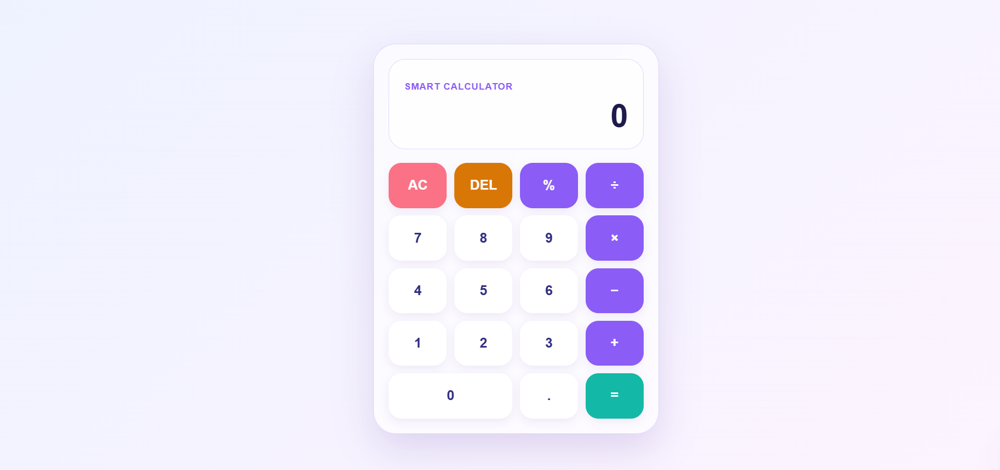
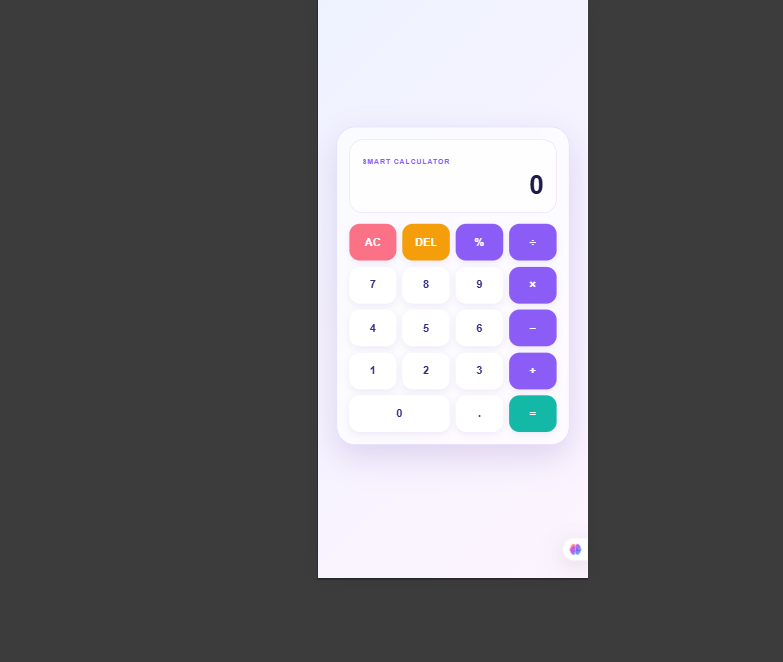

# 🧮 Smart Calculator

A modern, responsive calculator built using **HTML5, CSS3, and Vanilla JavaScript** as part of the **Oasis Infobyte Web Development & Designing Internship — Level 2, Task 1**.

The project provides a clean glass-style interface with interactive buttons, basic arithmetic operations, decimal calculations, and error handling.

---

## ✨ Features

* ➕ Addition
* ➖ Subtraction
* ✖️ Multiplication
* ➗ Division
* `%` Remainder operation
* 🔢 Decimal number calculations
* 🧹 **AC** — Clear the calculator
* ⌫ **DEL** — Delete the last digit
* ⚠️ Divide-by-zero error handling
* 🎨 Modern glass-style user interface
* 🖱️ Interactive hover and active effects
* 📱 Responsive design for different screen sizes
* 🚫 Calculation logic implemented without using `eval()`

---

## 🛠️ Technologies Used

* **HTML5** — Structure and semantic markup
* **CSS3** — Styling, Grid layout, responsive design and animations
* **JavaScript (Vanilla JS)** — Calculator functionality and calculation logic

---

## 📂 Project Structure

```text
Web Development & Designing-Level 2-Calculator/
│
├── index.html
├── style.css
├── script.js
├── README.md
│
└── screenshots/
    ├── calculator-desktop.png
    └── calculator-mobile.png
```

---

## 🚀 How to Run

### 1. Clone the repository

```bash
git clone https://github.com/09-Neeraj/OIBSIP.git
```

### 2. Open the project folder

```text
OIBSIP/
└── Web Development & Designing-Level 2-Calculator/
```

### 3. Run the project

Open `index.html` in any modern web browser.

You can also use **VS Code Live Server** for development.

---

## 🧠 Calculation Logic

The calculator does **not** use JavaScript's `eval()` function.

Instead, the application handles:

* Current input
* Previous input
* Selected operator
* Arithmetic calculation
* Invalid operations
* Divide-by-zero errors

This makes the calculation logic more controlled and easier to understand.

---

## 📱 Responsive Design

The calculator is designed to work across:

* 💻 Desktop
* 💻 Laptop
* 📱 Mobile devices
* 📟 Smaller screens

The layout automatically adapts to different screen sizes using CSS media queries.

---

## 📸 Screenshots

### Desktop View



### Mobile View



> Replace the placeholder paths with Markdown image syntax after adding the screenshots to the `screenshots` folder.

---

## 🎯 Internship Task

**Organization:** Oasis Infobyte

**Track:** Web Development & Designing

**Level:** Level 2

**Task:** Task 1 — Calculator

**Technologies:** HTML5, CSS3, Vanilla JavaScript

---

## 👨‍💻 Author

**Neeraj Vishwakarma**

Web Development & Designing Intern

---

## 📄 License

This project was created for educational and internship purposes as part of the Oasis Infobyte Internship Program.
