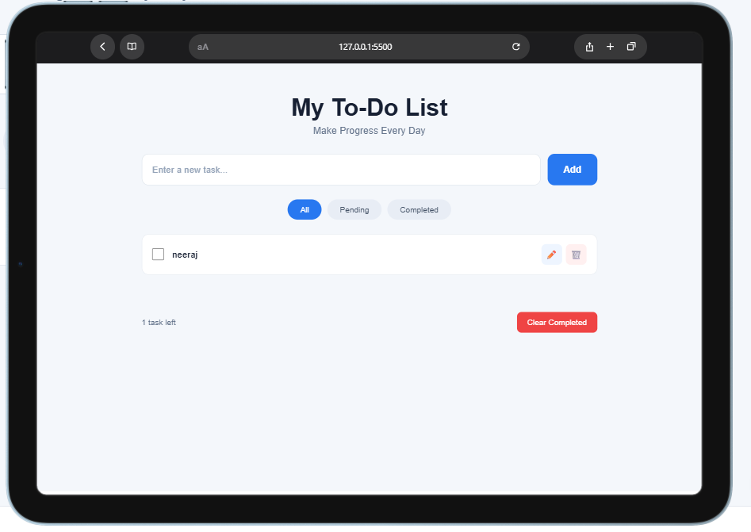
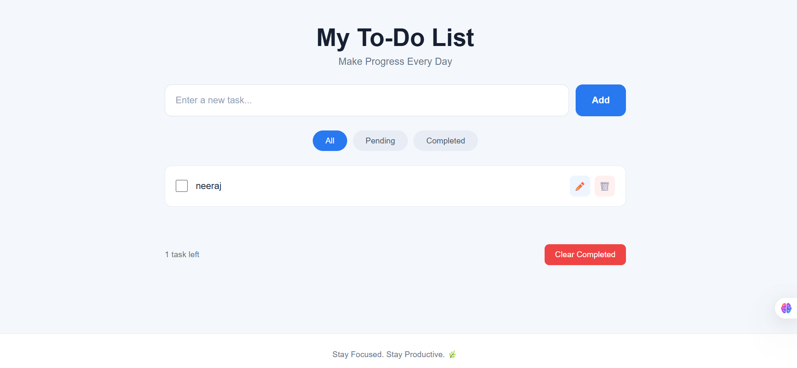

# 📝 To-Do Web App

A simple and responsive To-Do Web App built as part of the **Oasis Infobyte Web Development & Designing Internship – Level 2 Task 3**.

## ✨ Features

- ➕ Add new tasks
- ✅ Mark tasks as completed
- ✏️ Edit tasks
- 🗑️ Delete tasks
- 🔍 Filter tasks
- 💾 LocalStorage support
- 📱 Responsive design

## 🛠️ Technologies

- HTML5
- CSS3
- JavaScript

## 📸 Screenshots Responsive

### Mobile 


### Tablet


### Desktop 


## 📂 Project Structure

```text
To-Do-Web-App/
├── index.html
├── style.css
├── script.js
├── README.md
└── screenshots/
    ├--- todo-app.png
    └── completed-tasks.png