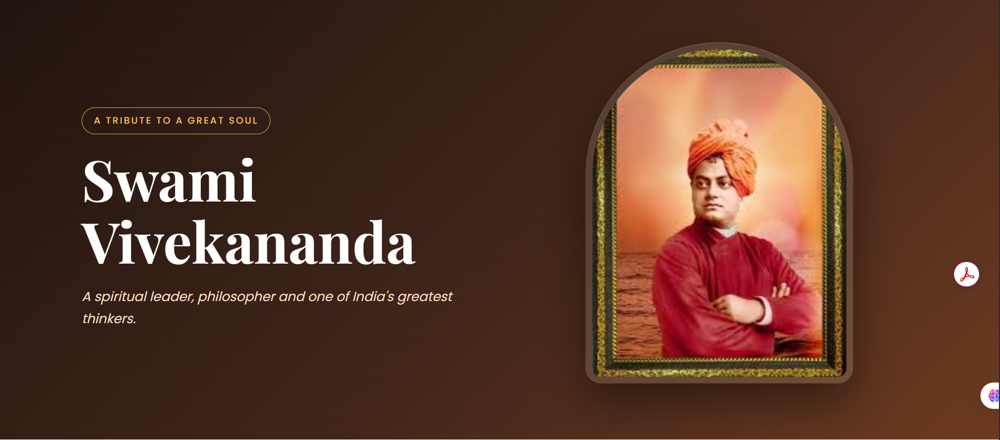
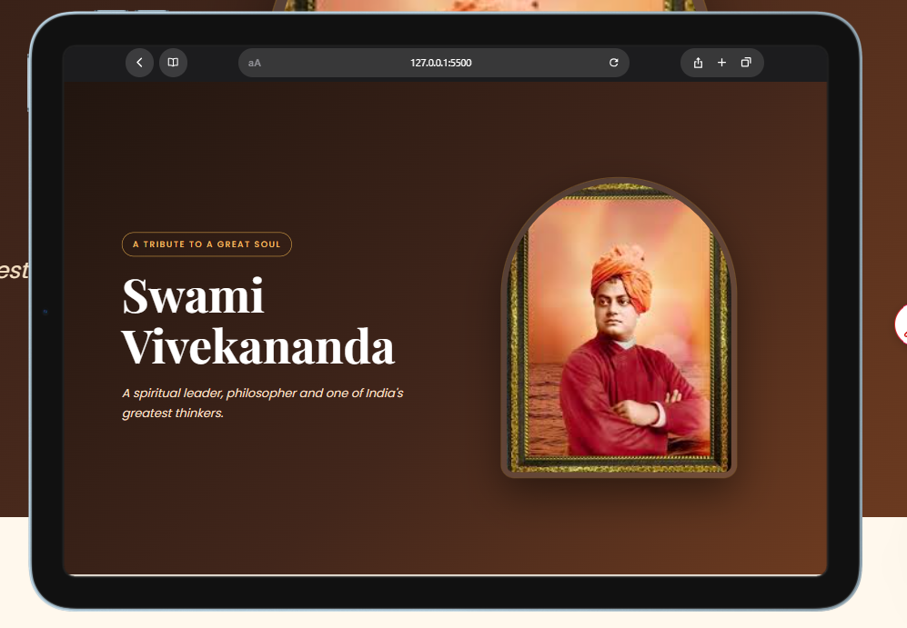
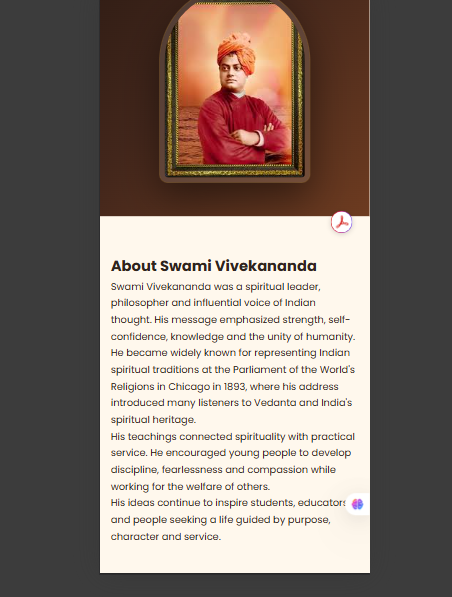

# 🌟 Swami Vivekananda Tribute Page

> A responsive tribute webpage dedicated to Swami Vivekananda — a great spiritual leader, philosopher, thinker, and source of inspiration for millions.

---

## 📌 OIBSIP Internship Project

This project is developed as part of the **Oasis Infobyte Web Development & Designing Internship Program**.

| Details | Information |
|---|---|
| 🏢 Organization | Oasis Infobyte |
| 💻 Track | Web Development & Designing |
| 📊 Level | Level 2 |
| 🎯 Task | Task 2 – Tribute Page |
| 👤 Project | Swami Vivekananda Tribute Page |
| 🛠️ Technologies | HTML5, CSS3 |
| 📱 Design | Responsive Web Design |

---

## 📖 About The Project

The **Swami Vivekananda Tribute Page** is a responsive and visually appealing website created to present the life, teachings, achievements, and legacy of Swami Vivekananda.

The project focuses on creating a clean, modern, and meaningful user interface using only **HTML5 and CSS3**.

The webpage contains a prominent hero section, biography, important events timeline, inspirational quote, and legacy section.

The design is responsive so that the website can be viewed comfortably on desktop, tablet, and mobile devices.

---

## ✨ Features

### 🏠 Hero Section

- Displays the name **Swami Vivekananda**
- Includes a meaningful tagline
- Prominent portrait image
- Elegant dark background
- Responsive two-column layout
- Smooth entrance animation

### 📖 Biography Section

- Provides an overview of Swami Vivekananda's life
- Uses multiple paragraphs for better readability
- Clean card-based design
- Comfortable typography and spacing

### 🕰️ Life Timeline

Important milestones are presented in a visually attractive timeline.

The timeline includes:

- **1863** – Birth of Swami Vivekananda
- **1881** – Meeting with Sri Ramakrishna
- **1893** – Historic speech at the Parliament of the World's Religions
- **1897** – Establishment of the Ramakrishna Mission
- **1902** – Passing away

### 💬 Inspirational Quote

A dedicated quote section highlights one of Swami Vivekananda's famous teachings:

> "Arise, awake, and do not stop until the goal is reached."

### 🌟 Legacy Section

The webpage highlights the continuing influence of Swami Vivekananda's ideas, teachings, and philosophy.

### 📱 Responsive Design

The website is optimized for:

- 💻 Desktop

- 📟 Tablet

- 📱 Mobile

### 🎨 Modern UI

The design includes:

- Warm color palette
- Premium card design
- Rounded corners
- Soft shadows
- Hover effects
- CSS animations
- Responsive typography

---

# 🛠️ Technologies Used

## HTML5

HTML5 is used to create the structure and semantic content of the webpage.

Main elements include:

- Header
- Main content
- Sections
- Headings
- Paragraphs
- Images
- Timeline
- Blockquote
- Footer

---

## CSS3

CSS3 is used for:

- Page layout
- Colors
- Typography
- Responsive design
- Flexbox
- CSS Grid
- Animations
- Hover effects
- Shadows
- Borders
- Spacing

---

## Google Fonts

The project uses two different font families:

- **Playfair Display**
- **Poppins**

Playfair Display is mainly used for headings, while Poppins is used for general content.

---

# 🎨 Design & Color Palette

The website uses a warm and elegant color combination.

| Color | Purpose |
|---|---|
| Dark Brown | Hero and footer |
| Warm Cream | Main background |
| Saffron / Golden | Accent and timeline |
| White | Content cards |
| Light Brown | Legacy section |

The color palette gives the website a traditional yet modern appearance.

---

# 📂 Project Structure

```text
Web Development & Designing-Level 2-Tribute-Page/
│
├── index.html
├── style.css
├── README.md
│
├── images/
│   └── swami-vivekananda.jpg
│
└── screenshots/
    ├── desktop.png
    ├── tablet.png
    └── mobile.png